# GitHub Actions Workflows

This directory contains the CI/CD pipeline for the Lockor VS Code extension, organized into **pipelines** (`pipe.*`) and **job components** (`job.*`).

## 🔄 Main Workflow Flow

```mermaid
graph TD
    A[Push to main/develop<br/>or PR to main] --> B[changes]
    B --> C{Changes?}
    C -->|extension| D[lint + code-analyze + build-test]
    C -->|no changes| E[Skip]
    
    D --> F{Branch?}
    F -->|main| G[version → tag → publish]
    F -->|develop| H[create-pr to main]
    F -->|PR| I[Ready for review]
    
    G --> J[📦 Published to Open VSX<br/>🏷️ GitHub Release]
    H --> K[🔀 Auto-PR created]
    
    style A fill:#e1f5fe
    style G fill:#e8f5e8
    style J fill:#e8f5e8
```



## 📝 PR Quality Control

**Enhanced PR Title Check**: Validates conventional commit format with helpful sticky comments
**Squash Enforcement**: Ensures merge commit message matches PR title

## 📅 Weekly Automation

**Dependency Updates**: Every Monday at 9 AM UTC, creates PRs with latest dependency updates

## 🎯 Key Workflows

| Workflow | Trigger | Purpose |
|----------|---------|---------|
| **`pipe.yml`** | Push to main/develop, PR to main | Main CI/CD pipeline |
| **`pipe.auto-deps.yml`** | Weekly schedule | Dependency updates |

## 📋 Job Components

| Job | Purpose |
|-----|---------|
| **CI Jobs** | |
| `job.ci.changes.yml` | Detects if extension or CI files changed |
| `job.ci.version.yml` | Semantic versioning based on commits |
| `job.ci.tag.yml` | Creates git tags for releases |
| **Build Jobs** | |
| `job.build.lint.yml` | TypeScript compilation + ESLint |
| `job.build.analyze.yml` | Security scanning |
| **Deploy Jobs** | |
| `job.deploy.publish.yml` | Publishes to Open VSX + GitHub releases |
| **PR Jobs** | |
| `job.pr.title-check.yml` | PR title validation with helpful feedback |
| `job.pr.squash-enforce.yml` | Ensures clean commit history |
| `job.pr.create.yml` | Creates PRs between branches |
| **Maintenance Jobs** | |
| `job.maintenance.deps.yml` | Updates dependencies automatically |

## 🔧 Setup Requirements

**Required Secret**: `OVSX_PAT` - Personal Access Token for [Open VSX Registry](https://open-vsx.org/-/user-settings/tokens)

## 🚀 Release Process

1. **Development**: Work on `develop` branch
2. **PR Creation**: Push to `develop` auto-creates PR to `main` 
3. **Review & Merge**: PR merge to `main` triggers release
4. **Automatic Release**: Version bump → Git tag → Open VSX publish → GitHub release

## 🛠️ Manual Commands


```bash
pnpm run package        # Create VSIX locally
pnpm run publish        # Publish to Open VSX  
pnpm run release        # Full release (version + publish)
```

---

*Simple, automated pipeline ensuring quality and consistent releases for the Lockor VS Code extension.* 🎯